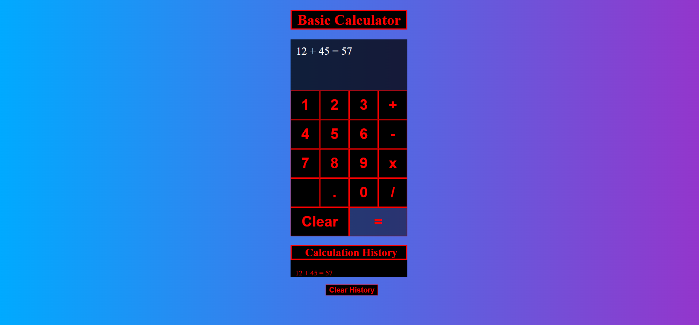

# My React Calculator

This project was bootstrapped with [Create React App](https://github.com/facebook/create-react-app).

## Available Scripts

In the project directory, you can run:

### `npm start`

## Description 
This was my first react project in which I am learning the basics of react and playing around with CSS - it shows a basic calculator which can do 
the operations of + - / x. The webpage should look as the following: 

